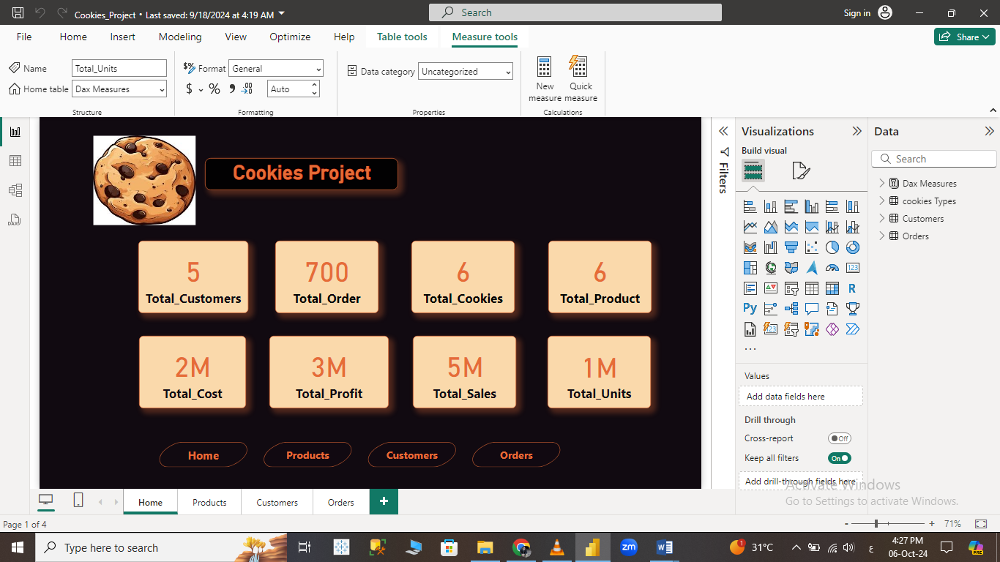
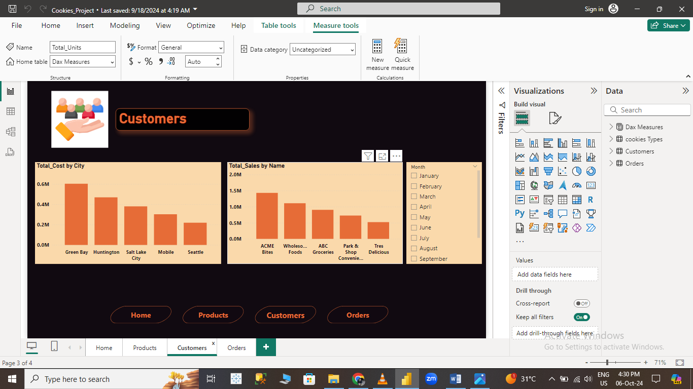

# 🍪 Cookie Sales Data Analysis Dashboard using Power BI

  
*(A demo of the interactive Cookie Sales Dashboard)*

---

## 📊 Overview

This project showcases a **Power BI Dashboard** developed to analyze a **Cookie Shop**sales performance. It provides valuable insights using various **DAX measures** and interactive visuals to aid decision-making for sales optimization.

The dataset includes tables such as:
- **Cookies Type**: Different types of cookies sold.
- **Customer**: Customer details and purchase history.
- **Orders**: Transactional data of cookie sales.

The dashboard uses **DAX measures** like **SUM**, **DISTINCTCOUNT**, and other functions to deliver key metrics such as total sales, order frequency, and customer analytics.

---

## 🚀 Key Features

- **Interactive Dashboard** with page navigation for easy exploration.
- **Sales Trends**: Analyze monthly, yearly, and seasonal trends in cookie sales.
- **Customer Insights**: Understand customer purchase behavior and preferences.
- **Product Analysis**: Review top-selling cookies and product performance.
- **Dynamic Filters**: Filter data by region, cookie type, and date.

---

## 🔍 Views in the Dashboard

### 1. **Cookies Type Table** 🍪
This table displays various cookie types available for sale. It includes:
- Cookie ID
- Cookie Name
- Category
- Price per unit

---

### 2. **Customer Table** 👥
The customer table provides insights into your customer base:
- Customer ID
- Name
- Age
- Gender
- Location

---

### 3. **Orders Table** 🛒
The orders table contains transactional data on cookie purchases:
- Order ID
- Customer ID
- Cookie ID
- Quantity Sold
- Order Date

M(Orders[Quantity] * Cookies[Price])
📂 Pages and Navigation
The Power BI Dashboard is organized with page navigation to help users explore different aspects of the cookie sales data:

Sales Overview 📊
Customer Insights 👥
Product Performance 🍪
Monthly Trends 📅

Users can seamlessly switch between views to get detailed insights, filter information, and drill down into specific areas of interest.

🛠️ Tools & Technologies Used
Power BI: Data visualization and dashboard development.
DAX: Custom measures and calculations for data analysis.
GitHub: For version control and project management.
📈 Key Insights
Top-Selling Cookies: The dashboard identifies the top-selling cookie types based on sales volume and revenue.
Customer Demographics: Insights into customer demographics, including age, location, and gender.
Sales Trends: Monthly and yearly sales trends to help forecast future sales.
📎 How to Run the Project
Clone the repository:

bash
Copy code
git clone https://github.com/your-username/cookie-sales-powerbi.git
Open the Power BI file (.pbix) in Power BI Desktop.

Refresh the data to ensure up-to-date visuals.

Navigate through the dashboard using the Page Navigator.

